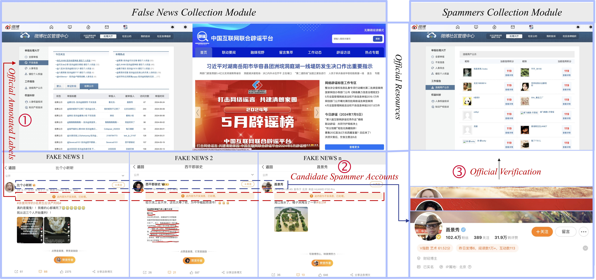

# Experimental Settings

**Platform Settings:** The experimental platform uses an M1 chip with 16GB memory, Python 3.10 and Tensorflow 2.10. The pre-trained BERT model is a transformers library version 4.37.2, with the model name ”bert-base-uncased”. The MFCC extraction algorithm uses librosa library.

**Algorithm Settings:**  Adam is chosen as the model optimizer, and the learning rate is set to 0.001. Meanwhile, the training time of the model is set to 100 epochs, and the optimal model parameters are preserved using an early stopping mechanism. The hyper-parameters of the model are set as follows: threshold f ansThre=partThre=1000, decay factor α=0.62/0.68, signal length (number of sampling points) T=5000/7500.

# Datasets Construction

**Collection:** The TWITTER dataset uses publicly available datasets[1]. Subsequently, the WEIBO dataset is constructed. The data collection process is shown in Fig. 1.

*Fig. 1 Collection process for spammer accounts*

**Spammer Account Collection:** In contrast to the TWITTER dataset, WEIBO officially identifies accounts as spammers by restricting access to other users and deleting accounts. The official measures are taken to prevent spammers from continuing to cause harm. Therefore, it is not possible to collect users from the official WEIBO spammer account display platform. However, as WEIBO is a mainstream social platform in China, it is important to identify spammers. To continue the research, we used other strategies to collect spammers' information. Because spammers often send fake news, information about users who send fake news is collected in advance. Subsequently, the candidate users are compared with the WEIBO spammer display platform to construct a spammer dataset. The specific process contains three main steps:

*Table 1 Resources used in the collection process*
<table>
  <tr>
    <th width="300" >Source</th>
    <th width="600" >Description</th>
    <th width="100" >URL</th>
  </tr>
  <tr>
    <th width="300" >Weibo Community Management Center</th>
    <th width="600" >The official display website for WEIBO. Displayed content is officially reviewed fake news, user dispute judgements and spammer accounts.</th>
    <th width="100" >https://service.account.weibo.com/</th>
  </tr>
  <tr>
    <th width="300" >Spammers Display Platform</th>
    <th width="600" >The official website of WEIBO for displaying spammers' accounts. All displayed accounts are determined based on user submissions and official manual review.</th>
    <th width="100" >https://service.account.weibo.com/toppunish</th>
  </tr>
  <tr>
    <th width="300" >Spam Display Platform</th>
    <th width="600" >The official website of WEIBO for displaying spam (fake news).</th>
    <th width="100" >https://service.account.weibo.com/?type=5\&status=4</th>
  </tr>
  <tr>
    <th width="300" >China Fact Check</th>
    <th width="600" >A platform to fact-check Chinese international news.</th>
    <th width="100" >https://chinafactcheck.com/</th>
  </tr>
  <tr>
    <th width="300" >China Joint Internet Rumor-Busting Platform</th>
    <th width="600" >A joint rumor ( fake news ) display platform launched by the Chinese government. It contains fake news from all social media platforms in China.</th>
    <th width="100" >https://www.piyao.org.cn/</th>
  </tr>
</table>

> *steps 1:* Collecting fake news. The Chinese government has constructed a rumor display platform to reduce the impact of rumors (fake news) (see Table 1 Button). The platform contains information on rumor topics across platforms, including WEIBO, TikTok (Douyin) and Xiaohongshu, etc. Meanwhile, WEIBO has also built its official rumor (fake news) display platform. Therefore, a fake news dataset is collected based on the official platform (see Fig. 1 Left).

> *steps 2:* Determine the order of spammer candidate accounts. The fake news dataset contains a large number of candidate accounts. When a user is identified as a spammer by WEIBO officials, the officials take action immediately. Meanwhile, the user's historical behavior information contains a large amount of data. For instance, a user with the nickname "Zhuge Lao Tiezhu" has more than 20,000 historical behaviors. In addition, the average number of user behaviors in the spreading space is more than 370,000, of which 199,753 are comments and 174,994 are retweets. The user's data consumes more than 470 MB. Therefore, it is necessary to determine the user's level of importance to target the best candidates more quickly. Considering that the more users send fake news, the potential to become spammers is higher. Therefore, we prioritize the collection of user history information by weighting the number of sent fake news (see Fig. 1 Left).

> *steps 3:* Identify the spammer account. Compare candidate accounts with the spammer display platform (see Table 1 Top) to determine the user is a spammer (see Fig. 1 Right). Simultaneously, information about spammers' historical behavior is put into our publicly available dataset. Due to the high real-time nature of this task, we have only correctly collected 342 items of data after one year. In the future, we will continue the data collection.

**Normal Account Collection:** Firstly, the account addresses are collected randomly. Subsequently, comparisons with the spammer display platform and the fake news dataset filtered for non-existent accounts. After that, normal accounts are screened using manual review. In particular, we collected a large number of normal accounts. Because TWITTER is a typical unbalanced dataset, our initial intention is to construct a balanced dataset to validate the model performance. Therefore, the 343 normal accounts are randomly selected to be put into our publicly available dataset.

